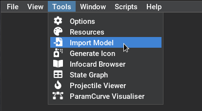
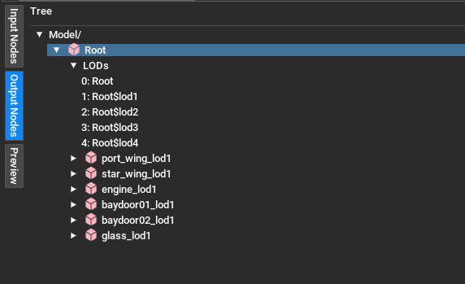
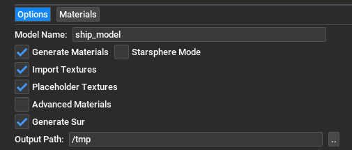
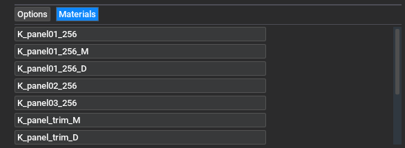

[TOC]
# Model Importer

The LancerEdit model importer supports creating both .cmp and .3db files (corresponding to multi-part and single-part models) from common model interchange formats. It will also create .sur collision hitbox files when applicable. The model importer may be accessed by going to **Tools -> Import Model**.

 

## Supported Formats

### glTF 2.0 (.glb/.gltf)

glTF 2.0 enjoys full support in the LancerEdit model importer. Selecting a .glb export (or .gltf embedded in your modelling software) will ensure all resources are packed into the glTF file.

This includes textures and custom properties.

### Wavefront .obj (.obj)

**Not recommended.** Only supports creating single part .3db files, custom properties and multipart models are not supported by this format.

### Collada (.dae)

A fallback import/export format for when glTF 2.0 is not supported by your modelling tool. Custom properties are not available in this format, so hardpoints and compound joints will not be imported correctly.

## Blender Integration

LancerEdit supports opening files from Blender, by performing an automatic export to glTF 2.0. LancerEdit will try to automatically detect an installation of Blender, but if it cannot find your installation of blender, you may set it manually in the options window.

- Go to **Tools -> Options** and set the Blender Path under the Import/Export tab.

## Model Hierarchy

LancerEdit requires your model to have the root mesh of your object at the root of your file, this will be the root part in the cmp, or the model of the 3db. It cannot be stored underneath an empty helper object. Children of that mesh are then stored as immediate children.

You can verify the generated model hierarchy in the **Output Nodes** tab of the model importer.

### Hardpoints

Hardpoints are stored as children of your meshes with a series of custom properties attached to them. Hardpoints must have a property attached to them called `hardpoint` that is non-empty and non-zero, which indicates to the model importer that it is a hardpoint.

Fixed hardpoints have the custom property `hptype` with value `"fix"`.

Revolute hardpoints have their `hptype` property set to `"rev"`, and also contain the following properties:

| Name | Value |
|-|-|
| min | Minimum angle in degrees (e.g. -45) |
| max | Maximum angle in degrees (e.g. 45) |
| axis | Array of 3 floats describing the axis of rotation (e.g. [0, 1, 0]).    *Note: This property is always in Y-Up space. Blender and other modelling packages do not work in Y-Up coordinates* |

### Collision Hulls

Collision hulls are stored as direct children of their parent, and have names ending with the text `$hull`. These meshes **must** be convex and have an even number of faces, or they will not create a usable .sur file.

### LODs

LOD meshes can be stored anywhere in the file, and are named `part name` plus e.g. `$lod1` for the 1st lod. If your model has a part called `wing`, your lod meshes for that part will be called `wing$lod1` and `wing$lod2` etc.

## Settings

- **Model Name**: The filename of the model output (minus the extension)
- **Generate Materials**: Controls whether or not a texture library and material library are created on import. When disabled, all texture-related options are disabled too.
- **Import Textures**: Controls whether or not to import textures from the model. This option is disabled when no textures are found in the import model.
- **Placeholder Textures**: Controls the generation of the default placeholder texture when the texture of a material is either not found or not specified. Disable this if you are providing the texture library externally.
- **Advanced Materials**: Select for importing PBR materials or normal maps from glTF or Blender files. This is an experimental setting, and the generated format is likely to change. These materials are not compatible with vanilla Freelancer out of the box.
- **Generate sur**: Controls whether or not a .sur collision model is generated. This option is disabled when no collision hulls are detected in the model.
- **Output Path**: The folder in which to save the generated .cmp/.3db (and optionally .sur)
- **Starsphere Mode**: Enable when importing a model intended to be used as a starsphere. This forces single part models to be generated as multi-part .cmp files. .3db models do not work as starspheres in vanilla Freelancer.

## Material Names

Referenced materials are listed in this tab, and the names of them can be edited here before saving the model file. This is useful if you wish to reference specific materials in an external .mat, or if you want to rename materials in your model to avoid name collisions once you've exported it.

