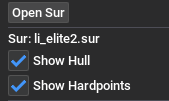
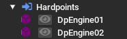
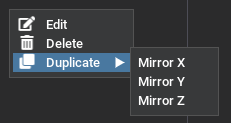
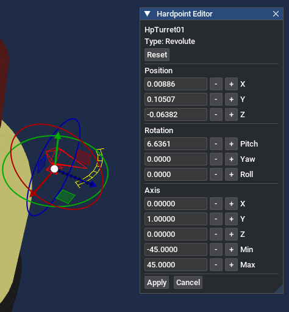
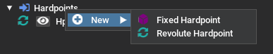
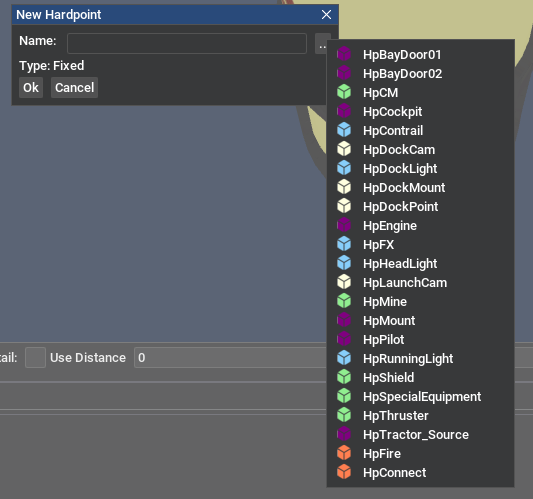
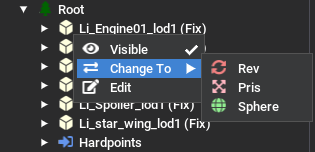
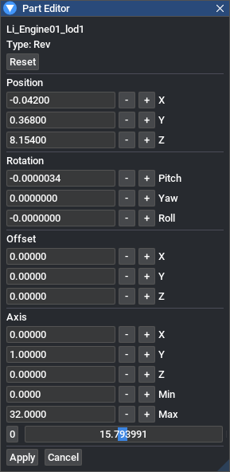
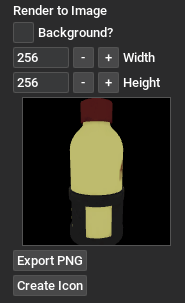
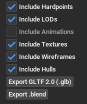

[TOC]
# Model Tab

The model tab may be accessed by pressing **View Model** at the bottom of a UTF tab.

## Textures and Materials

Unlike other tools, LancerEdit requires texture and material libraries to be open within the editor before being able to display them in the viewport. Missing textures/materials will be made evident through a default magenta material being applied.

Missing references may be found under **Tools→Resources**

## Viewport Controls

The controls for the viewport will be familiar to those who have used the Unreal Engine 4 Editor. The camera and the model are moved independently using the mouse.
The mode can be changed using the button in the bottom left of the window.

| Abbreviation   | Meaning            |
| ------------   | ------------------ |
| **LMB**        | Left Mouse Button  |
| **RMB**        | Right Mouse Button |

### Walkthrough Mode

| Control | Action |
| ------- | ------ |
| **LMB + Drag** | Move the camera forward and backward/left and right |
| **RMB + Drag** | Rotate the camera |
| **LMB + RMB + Drag** | Strafes camera up and down |
| **Ctrl + RMB** | Rotates the model |

### Arcball Mode

| Control | Action |
| ------- | ------ |
| **LMB + Drag** | Rotate the camera around the model |
| **RMB + Drag**/**Mouse Wheel**| Zoom in/out |
| **Ctrl + RMB** | Rotates the model |

### Starsphere Mode

- LMB pans around the inside of the model in this mode. There is no zoom.

## Hierarchy Panel

The Hierarchy panel provides an overview of all the parts and hardpoints of a model. For .3db models, this will all be under one
'Root' node. For .cmp models, the compound tree will be displayed here.

Hardpoints are displayed under the 'Hardpoints' tree node. Expanding this and clicking the eye symbol on the left-hand side of each Hardpoint name will toggle a hardpoint being displayed in the viewport.

### Viewing .sur Hitboxes

In the Hierarchy panel, select **Open Sur** to open the relevant collision model. The collision geometry will be rendered as a transparent overlay on top of the original mesh. In some cases where the collision model is slightly smaller than the visual mesh, it may be necessary to temporarily change the mesh view mode to **None**.

The main hull is displayed in red, and the hardpoint hulls are displayed in purple.

### Editing Hardpoints

The hardpoints for a given part can be found in the Hierarchy Panel, in a list labelled Hardpoints underneath the part. 

Clicking the eye icon will toggle displaying the hardpoint in the viewport. To modify a hardpoint, right click it to open the context menu. You will have the option to edit the hardpoint, delete it, or duplicate it - mirroring along the X, Y, or Z axis.

When editing a hardpoint, you can choose to edit the values directly in the hardpoint information window. Or if you are simply moving a hardpoint, you can click and drag the handles present in the viewport. The arrows change the position of the hardpoint, and the circles change the rotation.

You can also create a new hardpoint by right-clicking on the hardpoint list, where you will be given the option to create a Fixed or Revolute hardpoint.

The New Hardpoint dialog contains a list of handy template names to use that follow the standard Freelancer naming conventions.

When you have finished editing hardpoints, you must press the **Apply Hardpoints** button in order for your changes to be written back to the model's UTF tab.

### Editing Parts

Right clicking any part except root in the left hand side allows you to change the type of the part to one of Fix, Pris, Rev or Sphere.

You can also edit the part - changing its position, orientation, and maximum angles. 

The slider at the bottom allows you to preview how the part will look at each rotation or translation for the applicable part types.

When you have finished editing parts, you must press the **Apply Parts** button in order for your changes to be written back to the model's UTF tab.

## Rendering Models

The **Render** panel allows you to create an image showing the contents of the current viewport.

Enabling Background will copy the current viewport's background colour, leaving it disabled will generate a .png with a transparent background.

Pressing Export PNG will create a .png file, and pressing Create Icon will directly create a .3db icon as detailed in [Generating .3db icons](genicons.md).

Note: Your MSAA and Texture Filter settings in the Options window apply to objects rendered here. For best quality, consider selecting the highest Anisotropic filtering setting and enabling MSAA before saving a model.

## Exporting Models

The **Export** panel allows exporting models to be viewed in external tools, or edited and re-imported back into LancerEdit. It is best practice to keep your source model files for models you import into LancerEdit, as editing data is discarded when converting from your 3d modelling software's format to optimized Freelancer models.

For editing purposes it is recommended to keep all options **enabled**, as this allows for the majority of the model's data to be recreated when importing into LancerEdit. However, if you intend to view the model in external tools without editing, it is recommended to disable all options except Include Textures.

The model exporter supports exporting to glTF 2.0 binary files (.glb), and if Blender integration is enabled (see the Import/Export panel in options),  .blend files. Exporting to Collada (.dae) is not recommended, but can be enabled from the Import/Export panel if necessary. Re-importing a model exported to Collada will not work.

Textures exported from this panel are in .png format, with the compressed DDS embedded in the metadata if applicable. These files are slightly larger than standard PNGs, but allow for textures to be transferred back into LancerEdit without generation loss from re-compressing the image. If these .png files are edited, the compressed DDS data will be lost - and the texture will be imported again as normal.

## Presets Panel

Click the "Save Camera Preset" button in order to save your current camera settings. These presets are scaled by the size of the viewed model, and can be used to get the same camera angle across multiple models quickly.

